<div align="center">

# 🦎 ESP32-TOOLS

### Firmware multi-herramienta de seguridad WiFi + Bluetooth para ESP32

*Inspirado en Flipper Zero, Bruce y ESP32 Marauder — hecho desde cero en México*

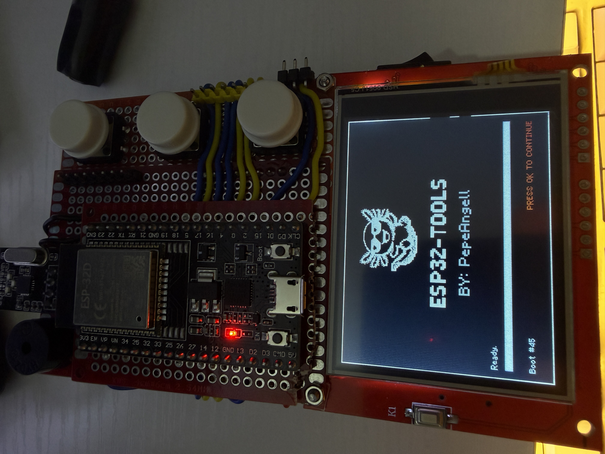

**By PepeAngell** · [Instagram](https://instagram.com/pepeangelll) · [Facebook](https://www.facebook.com/esp32tools/) · [GitHub](https://github.com/pepeangell5)


</div>

---

## 📖 ¿Qué es ESP32-TOOLS?

**ESP32-TOOLS** es un firmware completo para un multi-tool portátil basado en ESP32, diseñado para pruebas de seguridad WiFi y Bluetooth. Incluye scanner de redes, analizador de espectro, monitor de paquetes, generador de beacons, deauther, disruptor Bluetooth y más — todo con una UI propia estilo consola retro con nuestra mascota oficial: un ajolote con lentes de sol. 😎

Inspirado en proyectos como **Flipper Zero**, **ESP32 Marauder** y **Bruce**, pero construido desde cero con personalidad propia, en español, y pensado para la comunidad maker hispanohablante.

---

## ⚠️ Aviso legal

Esta herramienta está pensada con fines **educativos y de pentesting en redes propias o con autorización explícita**. Varias de sus funciones (Deauther, BT Disruptor, Beacon Spam) pueden causar interferencias en redes de terceros.

**En México y la mayoría de países, el uso de estas herramientas contra redes o dispositivos ajenos sin consentimiento constituye un delito federal.** El autor no se hace responsable del mal uso del firmware. Tú eres 100% responsable de cómo lo utilices.

Usa con cabeza. 🧠

---

## 🛠️ Herramientas incluidas

<div align="center">

| Categoría | Herramientas |
|:---|:---|
| 📡 **WiFi** | WiFi Scanner · Beacon Spam · Deauther |
| 🔵 **Bluetooth** | BLE Scanner · BLE Spam · BT Disruptor |
| 📻 **Radio 2.4GHz** | Jammer · Spectrum Analyzer (3 modos) |
| 📊 **Monitoreo** | Packet Monitor |
| ⚙️ **Sistema** | Settings · System Info |

</div>

---

## 📸 Galería

### Menú principal estilo carrusel

<div align="center">
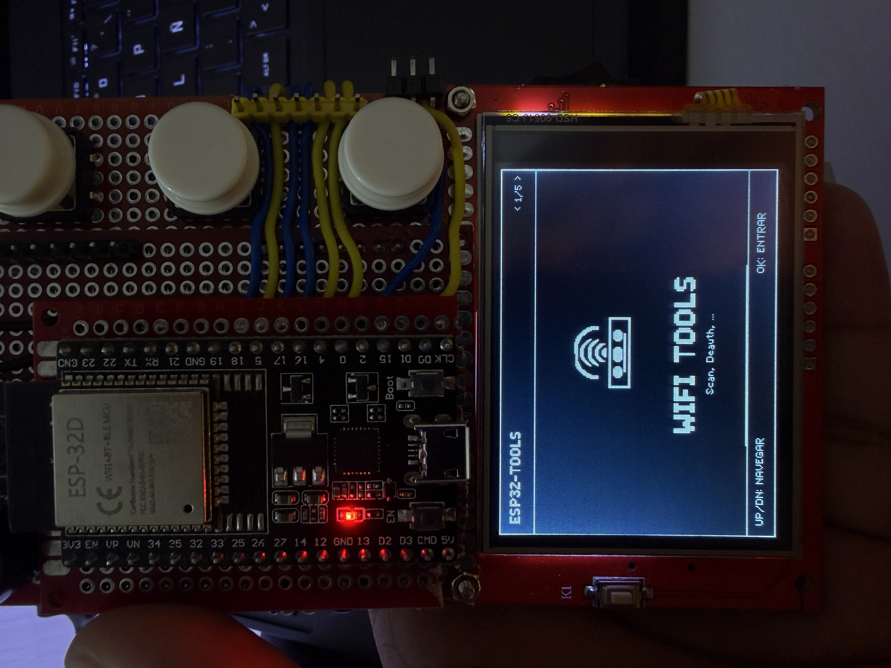
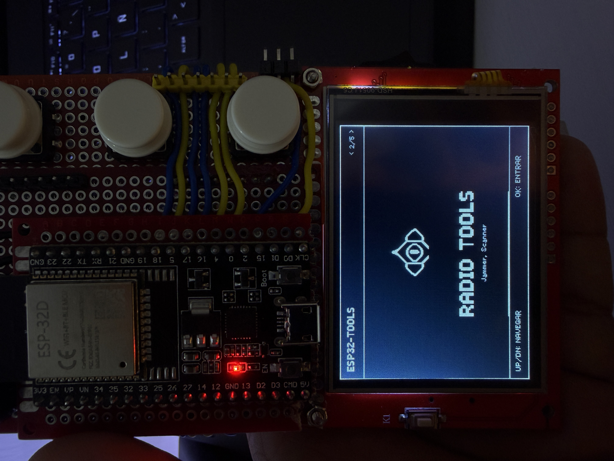
</div>

Navegación vertical tipo Flipper con íconos pixel art 64x64 para cada categoría. Animación slide suave, OK flash con beeps, y 5 categorías: **WiFi · Radio · Bluetooth · Monitor · System**.

---

### 📡 WiFi Tools

<div align="center">
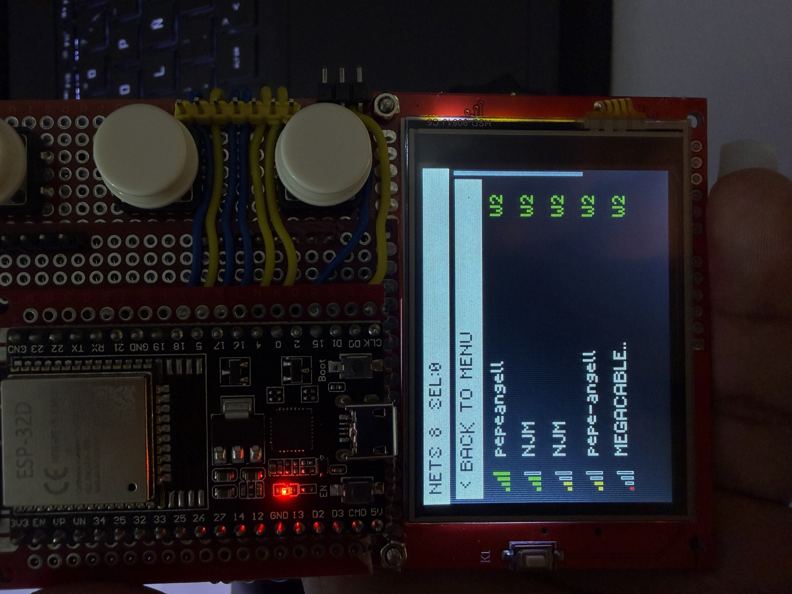
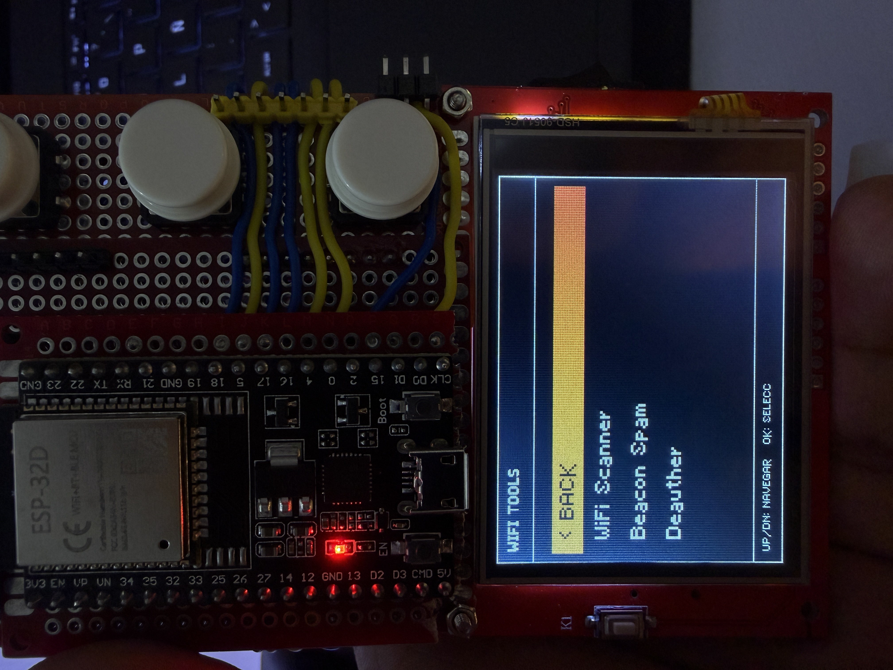
</div>

**WiFi Scanner** — descubre todas las redes 2.4GHz cercanas con SSID, canal, RSSI, tipo de encripción (WEP/WPA2/WPA3 con colores), detección de redes ocultas y lookup de fabricantes mexicanos (Telmex, Totalplay, Izzi, Megacable, AT&T, etc.) por OUI.

**Beacon Spam** — transmite cientos de redes WiFi ficticias con channel hopping (CH 1→6→11) y BSSID rotation. 5 modos temáticos:

<div align="center">
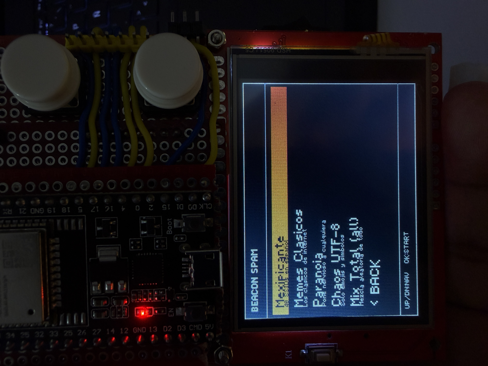
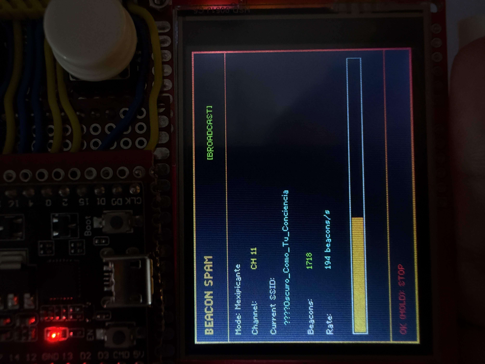
</div>

- 🌶️ **Mexipicante** — 40 SSIDs picantes en español
- 🎭 **Memes Clásicos** — FBI_Van, Virus.exe, etc.
- 😱 **Paranoia** — "Camara_Oculta_Activa", "Te_Estamos_Grabando"...
- 💀 **Chaos UTF-8** — solo emojis y símbolos
- 🎪 **Mix Total** — todos combinados (~100 SSIDs únicos)

Rate de transmisión: ~190 beacons/sec.

**Deauther** — desconecta dispositivos de redes WiFi usando deauth frames 802.11.

<div align="center">
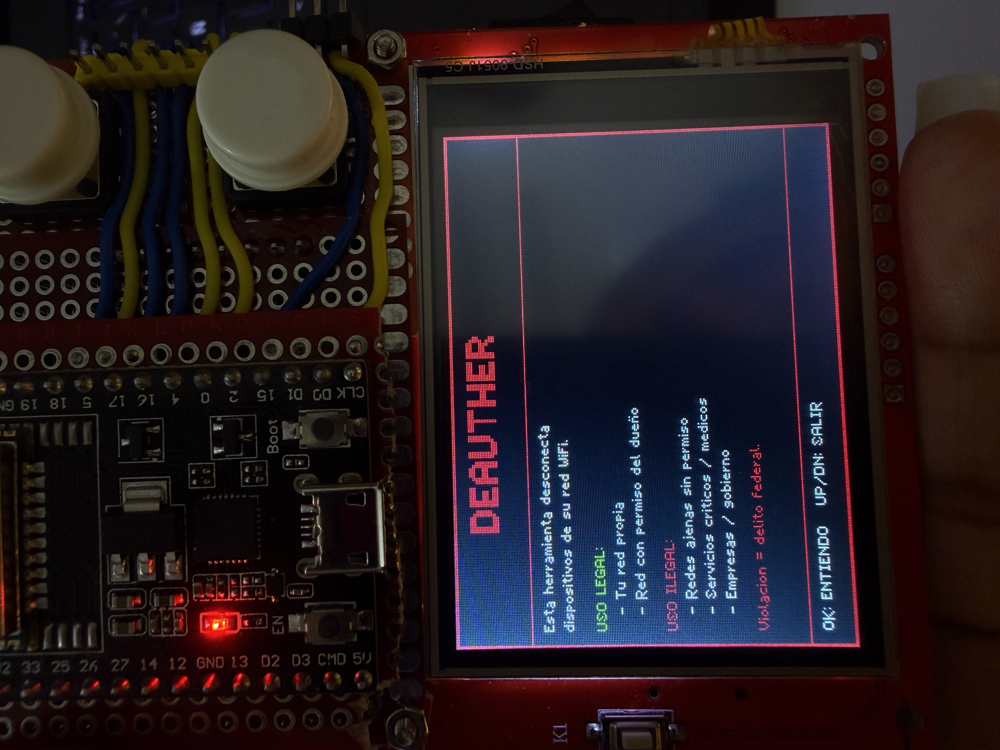
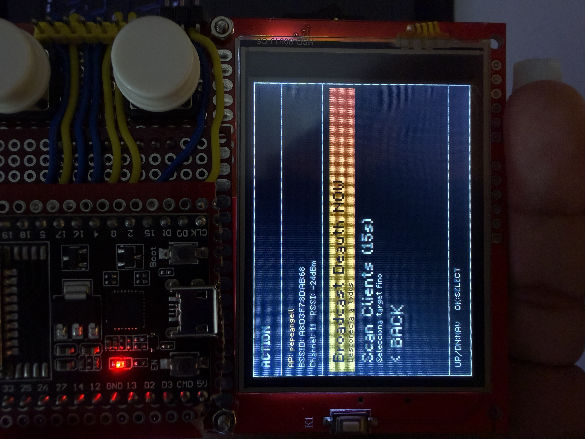
</div>

- Scan de APs con selección visual
- Scan de clientes conectados (modo promiscuo)
- Ataque dirigido a un cliente específico o broadcast al AP completo
- **Rambo Mode**: ataque simultáneo a todas las APs con channel hopping
- Requiere patch del SDK (instrucciones en la sección de instalación)

---

### 🔵 Bluetooth Tools

<div align="center">
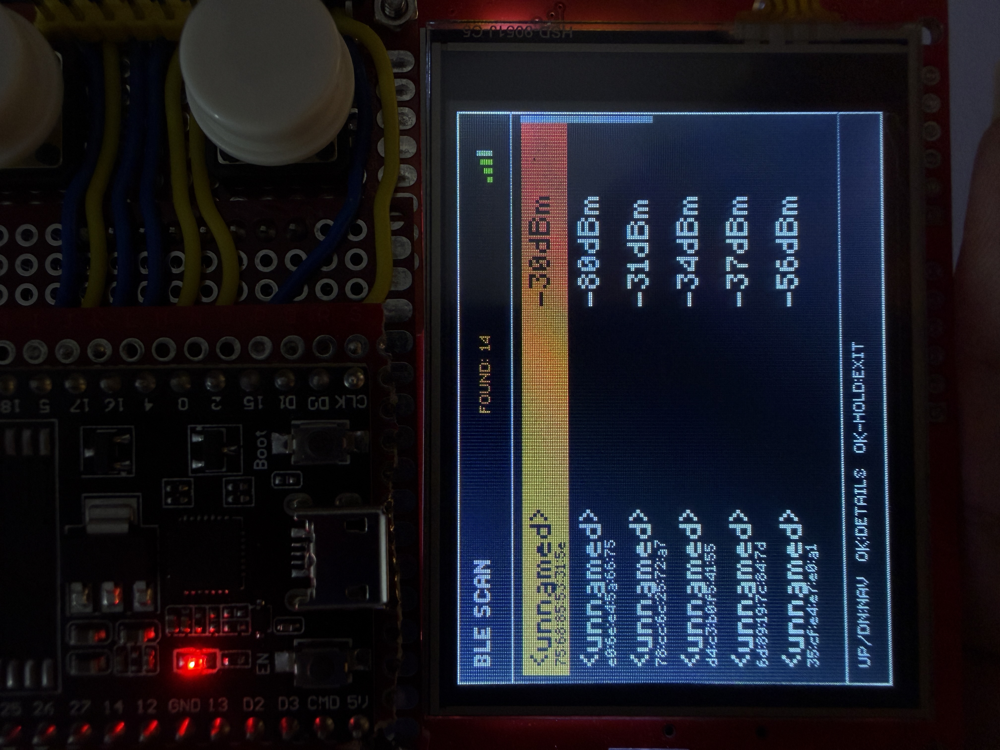
</div>

**BLE Scanner** — descubre dispositivos Bluetooth Low Energy cercanos (AirPods, smartwatches, beacons, tags, etc.). Lista ordenada por RSSI con barras de señal, lookup de vendor por OUI (Apple, Samsung, Xiaomi, Microsoft, Google, y ~20 más), pantalla de detalles con MAC, servicios advertisers y manufacturer data en hex.

**BLE Spam** — transmite advertisements BLE falsos que disparan popups de pairing en dispositivos cercanos. 5 protocolos implementados:

- 🍎 **Apple Continuity** — popups de AirPods Pro, AirPods Max, Beats, Apple TV (13 modelos)
- 📱 **Samsung Easy Setup** — Galaxy Buds Pro, Buds 2, Buds FE (7 modelos)
- 🪟 **Microsoft Swift Pair** — teclados, mouse Surface, Xbox Controller
- 🟢 **Google Fast Pair** — Pixel Buds, Nest devices
- 🌪️ **CHAOS Mode** — rota los 4 protocolos aleatoriamente

**BT Disruptor** — ataque dirigido a un dispositivo BLE específico. Tras escanear y seleccionar target, genera connection flood, L2CAP ping storm, spoof de identidad o chaos combinado. Útil para degradar conexión de audífonos/bocinas BLE.

---

### 📻 Radio Tools

<div align="center">
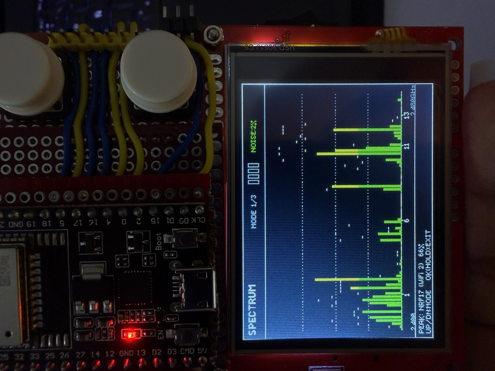
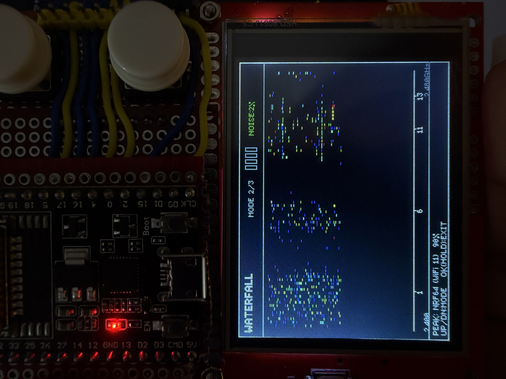
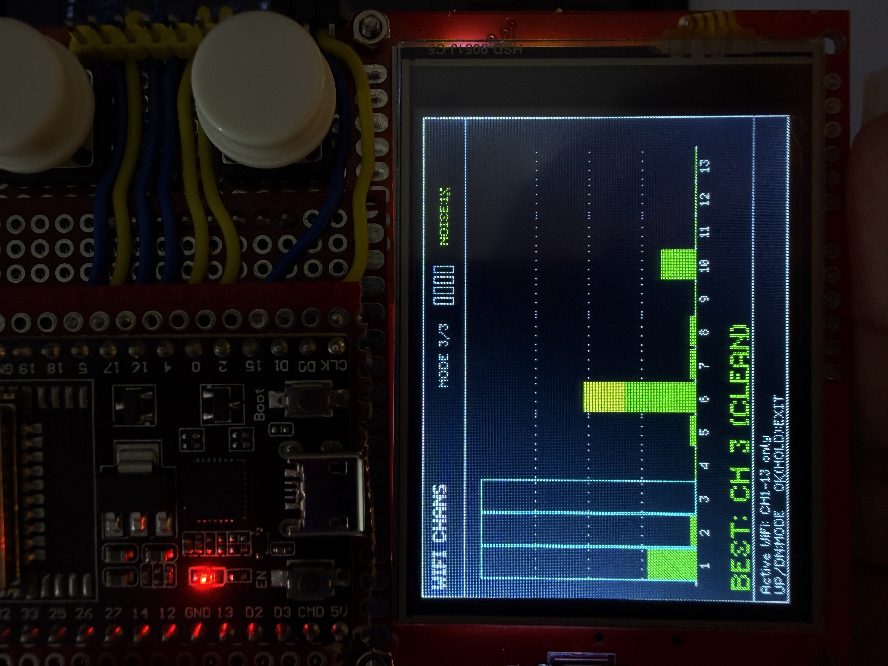
</div>

**Radio Scanner** con NRF24L01 — analizador de espectro 2.4GHz con 3 modos:

- **SPECTRUM** — 80 barras con gradient vertical, peak hold, sonido geiger
- **WATERFALL** — 166 rows de historial temporal con mapa de colores
- **WIFI CHANS** — 13 barras (una por canal WiFi), recomendación de mejor canal

**Radio Jammer** — transmisión continua en 2.4GHz con el NRF24. 3 modos: Turbo (concentrado), Wide (±2 canales), Barrido (los 14 canales WiFi). *Nota: el jamming es ilegal en México fuera de contextos educativos aislados.*

---

### 📊 Packet Monitor

<div align="center">
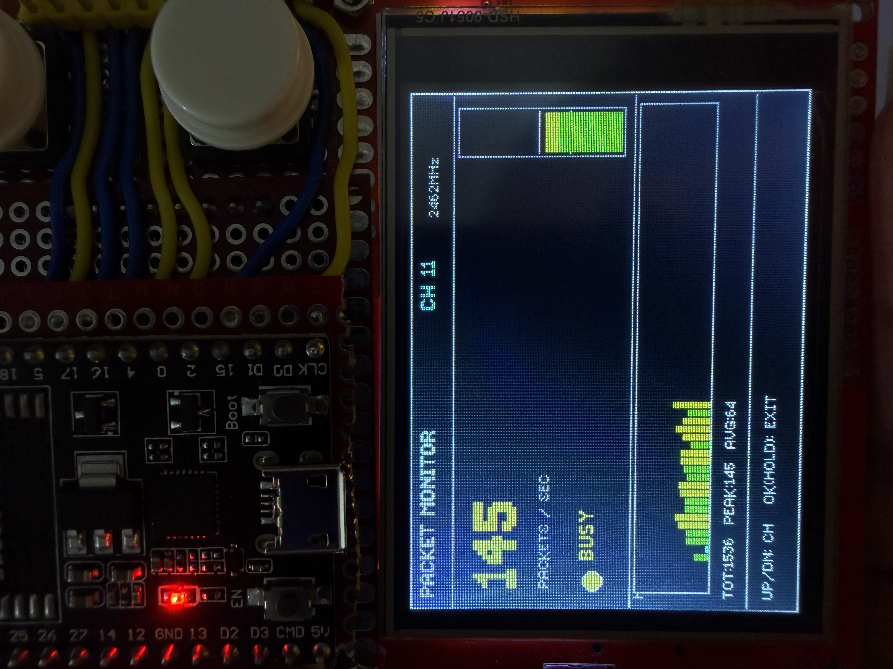
</div>

Sniffer promiscuo de paquetes 802.11 por canal. Muestra PPS (packets per second) con código de colores, VU meter vertical, gráfico histórico de 60 segundos y stats acumulados. 6 niveles de actividad (QUIET → LOW → ACTIVE → BUSY → HEAVY → FLOODED) con sonidos ambient distintos por nivel.

---

## 🔧 Hardware necesario

Lista de componentes para replicar este proyecto. Todo conseguible en México por Amazon, Mercado Libre o Steren por aproximadamente **$400-500 MXN** en total.

### Componentes principales

| Componente | Modelo específico | Función |
|:---|:---|:---|
| **Microcontrolador** | ESP32-D (ESP32-WROOM-32, 30 pines) | Cerebro, WiFi + BT/BLE integrado |
| **Radio 2.4GHz** | NRF24L01+ (con antena PCB integrada) | Analizador de espectro + jammer |
| **Pantalla** | TFT LCD Shield 2.4" ILI9341 (paralela 8-bit) | Display 320x240 |
| **Botones** | 3 × push buttons 12mm (arcade-style) | Navegación: UP / OK / DOWN |
| **Buzzer** | Buzzer pasivo 5V | Audio feedback |
| **Batería** | LiPo 3.7V 1000mAh | Portabilidad |
| **Carga batería** | Módulo TP4056 con protección | Carga por USB |
| **Convertidor DC-DC** | Step-Up MT3608 ajustable a 5V | Alimenta ESP32 y pantalla |
| **Switch** | Interruptor deslizable 2 posiciones | Power on/off |
| **PCB prototipo** | Placa perforada 7x9cm (o similar) | Montaje físico |

### Opcional
- Cables jumper dupont (hembra-macho, macho-macho)
- Pin headers 2.54mm
- Case 3D printed (pendiente para una siguiente versión)

---

## 🔌 Diagrama de conexiones

### ESP32 ↔ Pantalla TFT LCD Shield 2.4" (paralela 8-bit)

| Pantalla (Shield) | ESP32 (GPIO) | Función |
|:---|:---:|:---|
| D0 | 12 | Data bus bit 0 |
| D1 | 13 | Data bus bit 1 |
| D2 | 14 | Data bus bit 2 |
| D3 | 27 | Data bus bit 3 |
| D4 | 16 | Data bus bit 4 |
| D5 | 17 | Data bus bit 5 |
| D6 | 18 | Data bus bit 6 |
| D7 | 19 | Data bus bit 7 |
| RS / DC | 2 | Command/Data select |
| WR | 15 | Write control |
| CS | 5 | Chip Select |
| RST | 4 | Reset |
| RD | 3.3V | Read (fijo alto) |
| VCC | 5V (del Step-Up) | Alimentación backlight |
| GND | GND | Tierra |

### ESP32 ↔ NRF24L01

| NRF24L01 | ESP32 (GPIO) | Función |
|:---|:---:|:---|
| CE | 21 | Chip Enable |
| CSN | 32 | Chip Select Not |
| SCK | 25 | SPI Clock |
| MISO | 26 | SPI Master In Slave Out |
| MOSI | 33 | SPI Master Out Slave In |
| VCC | 3.3V | ⚠️ No conectar a 5V |
| GND | GND | Tierra |

### Botones

| Botón | ESP32 (GPIO) | Resistencia pull-up |
|:---|:---:|:---:|
| UP (arriba) | 34 | ✅ Sí (externa) |
| OK (centro) | 35 | ✅ Sí (externa) |
| DOWN (abajo) | 23 | ❌ Usa pull-up interno |

> **Nota:** GPIO 34 y 35 son solo-input en el ESP32, por eso requieren pull-up externo (10kΩ a 3.3V). El GPIO 23 usa el pull-up interno del ESP32 (`INPUT_PULLUP`).

### Buzzer

| Buzzer | ESP32 |
|:---|:---:|
| Positivo (+) | GPIO 22 |
| Negativo (-) | GND |

### Alimentación

```
Batería 3.7V 1000mAh ──► TP4056 (carga USB) ──► Switch ──► Step-Up MT3608 (ajustado a 5V) ──► ESP32 VIN + TFT VCC
                                                                                               │
                                                                                               └──► 3.3V regulado del ESP32 ──► NRF24 VCC
```

> ⚠️ **Importante:** el NRF24 **no tolera 5V**. Siempre alimentarlo con los 3.3V del ESP32.

---

## 🚀 Instalación y compilación

### Requisitos previos

1. **VS Code** ([descargar](https://code.visualstudio.com/))
2. **PlatformIO IDE** (extensión de VS Code — instalar desde el marketplace)
3. **Python 3** (viene con PlatformIO)
4. **Driver USB del ESP32** (CP210x o CH340 según tu módulo)

### Clonar el repositorio

```bash
git clone https://github.com/pepeangell5/ESP32-TOOLS.git
cd ESP32-TOOLS
```

### Compilar y cargar

Abre la carpeta en VS Code. PlatformIO detectará automáticamente el `platformio.ini`. Solo dale:

1. **Build** (✓ en la barra inferior)
2. Conecta el ESP32 por USB
3. **Upload** (→ en la barra inferior)

El firmware se compilará (~2-3 minutos la primera vez por BLE) y se cargará al ESP32.

---

## 🔓 Patch para el Deauther

**Solo necesario si vas a usar la herramienta Deauther.** A partir del framework Arduino-ESP32 versión 2.0.7+, Espressif bloquea la transmisión de frames de deauth vía `esp_wifi_80211_tx()`. Este patch revierte ese bloqueo.

### Windows (PowerShell)

```powershell
C:\Users\TU_USUARIO\.platformio\packages\toolchain-xtensa-esp32\bin\xtensa-esp32-elf-objcopy.exe --weaken-symbol=ieee80211_raw_frame_sanity_check C:\Users\TU_USUARIO\.platformio\packages\framework-arduinoespressif32\tools\sdk\esp32\lib\libnet80211.a C:\Users\TU_USUARIO\.platformio\packages\framework-arduinoespressif32\tools\sdk\esp32\lib\libnet80211.a
```

Reemplaza `TU_USUARIO` con tu nombre de usuario de Windows.

### Linux / macOS

```bash
~/.platformio/packages/toolchain-xtensa-esp32/bin/xtensa-esp32-elf-objcopy --weaken-symbol=ieee80211_raw_frame_sanity_check ~/.platformio/packages/framework-arduinoespressif32/tools/sdk/esp32/lib/libnet80211.a ~/.platformio/packages/framework-arduinoespressif32/tools/sdk/esp32/lib/libnet80211.a
```

### Cómo funciona

`objcopy --weaken-symbol` marca la función `ieee80211_raw_frame_sanity_check` como "débil". Esto permite que el firmware provea su propia versión que siempre retorna 0 (ya está incluida en `Deauther.cpp`), permitiendo que todos los frames pasen al radio.

> **Si reinstalas PlatformIO o actualizas el framework, hay que reaplicar el patch.**

---

## 📁 Estructura del proyecto

```
ESP32-TOOLS/
├── include/                    # Headers
│   ├── Pins.h                  # Definición de pines
│   ├── PepeDraw.h              # Motor de fuentes custom (5x7 + 8x12)
│   ├── MenuSystem.h            # Carrusel principal
│   ├── WifiScanner.h
│   ├── BeaconSpam.h
│   ├── Deauther.h
│   ├── BLEScanner.h
│   ├── BLESpam.h
│   ├── BTDisruptor.h
│   ├── RadioScanner.h
│   ├── RadioJammer.h
│   ├── PacketMonitor.h
│   ├── Settings.h
│   ├── SettingsMenu.h
│   ├── SystemInfo.h
│   ├── SplashScreen.h
│   ├── NVSStore.h
│   ├── Icons.h
│   └── SoundUtils.h
├── src/                        # Implementaciones
│   ├── Main.cpp
│   └── [todos los .cpp]
├── img/                        # Capturas del proyecto
├── platformio.ini              # Config de PlatformIO
├── LICENSE
└── README.md
```

---

## 🎮 Controles básicos

| Botón | Acción |
|:---|:---|
| **UP / DOWN** | Navegar menús, cambiar modos |
| **OK (click corto)** | Seleccionar / entrar |
| **OK (mantener ~300-500ms)** | Salir / volver atrás |

El firmware usa detección de press corto vs. hold para distinguir selección de salida, evitando la necesidad de un 4to botón.

---

## 🎨 Características destacadas

- **Fuente custom PepeDraw v2** — dos fuentes propias (5×7 small y 8×12 big) con ~220 glyphs incluyendo acentos españoles (á é í ó ú ñ ¿ ¡)
- **Splash screen animado** con el ajolote pixel art (96x80) scan-in, type-on de texto y beeps ascendentes
- **Persistencia en NVS** — settings de sonido y contador de boots sobreviven reinicios
- **Menús jerárquicos** con navegación consistente y animaciones slide
- **Paleta monocromática con acento naranja-rojo** (UI_SELECT 0xFA20) — estilo Flipper/terminal retro
- **Sonidos contextuales** por herramienta — geiger en Spectrum, siren en Packet Monitor flooded, chirps de startup/exit

---

## 🗺️ Roadmap futuro

Ideas para versiones siguientes (pull requests bienvenidos):

- [ ] **Evil Portal** (portal cautivo con AP + DNS + captura de credenciales)
- [ ] **PMKID Attack** para captura de hashes WPA2
- [ ] **Probe Request Sniffer** (captura de nombres de redes que buscan los celulares)
- [ ] **Screensaver** con animación del ajolote
- [ ] **Indicador de batería** en todos los headers
- [ ] **Case 3D printable** con diseño dedicado
- [ ] **Soporte para SD card** (log de captures, pcap export)

---

## 📜 Licencia

Este proyecto está bajo licencia **MIT** — ver [LICENSE](LICENSE) para detalles.

En resumen: puedes usar, modificar y distribuir este código libremente, incluso comercialmente, siempre que incluyas el copyright original.

---

## 🙌 Créditos y agradecimientos

- Inspiración general: [Flipper Zero](https://flipperzero.one/), [ESP32 Marauder](https://github.com/justcallmekoko/ESP32Marauder), [Bruce firmware](https://github.com/pr3y/Bruce), [Spacehuhn ESP8266 Deauther](https://github.com/SpacehuhnTech/esp8266_deauther)
- Librerías: [TFT_eSPI](https://github.com/Bodmer/TFT_eSPI) (Bodmer), [RF24](https://github.com/nRF24/RF24) (TMRh20), Arduino-ESP32 (Espressif)
- SDK patch técnica: comunidad Arduino-ESP32, [Jeija/esp32free80211](https://github.com/Jeija/esp32free80211)
- Protocolos BLE (Apple Continuity, Samsung, MS Swift Pair, Google Fast Pair): reverse engineering público de la comunidad
- Ajolote mascota: diseño original del proyecto 🦎😎

---

## 📬 Contacto

**José Ángel Chávez Félix (PepeAngell)**

- 📧 **Email:** [joseangelchavezfelix@gmail.com](mailto:joseangelchavezfelix@gmail.com)
- 📸 **Instagram:** [@pepeangelll](https://instagram.com/pepeangelll)
- 📘 **Facebook:** [ESP32-TOOLS](https://www.facebook.com/esp32tools/)
- 🐙 **GitHub:** [@pepeangell5](https://github.com/pepeangell5)

Si te gustó el proyecto, ⭐ una estrella en el repo ayuda muchísimo. Si lo armas, mándame fotos — me encanta ver qué hacen otros makers con él.

---

<div align="center">

**Made with ❤️ and 🌶️ in Los Mochis, Sinaloa, México**

*El conocimiento y la informacion siempre deben ser gratuitos.*

</div>